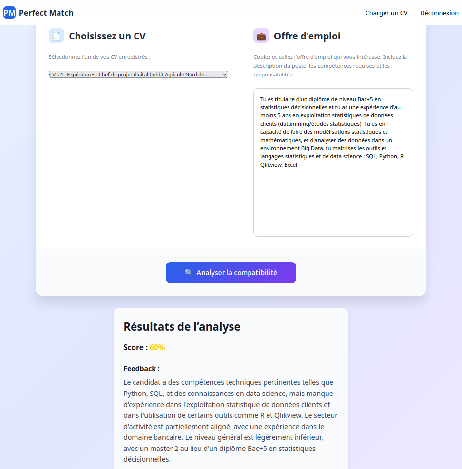

# LLM Perfect Match

## ➔ Sommaire

- [➔ Structure du projet](#-structure-du-projet)
- [➔ Installation & Lancement](#-installation--lancement)
- [➔ Fonctionnalités](#-fonctionnalités)
- [➔ Exemples de résultat](#-exemples-de-résultat)
- [➔ Critères d’évaluation](#-critères-dévaluation)
- [➔ Indicateurs de performance](#-indicateurs-de-performance)
- [➔ Licence](#-licence)
- [➔ Auteurs](#-auteurs)

---

## 🗂️ Structure du projet

Ce projet construit une interface en **Django** qui permet de faire le *matching* parfait entre questions utilisateurs et réponses adaptées générées par un modèle LLM (GPT-like).

Dossier `Projet_LLM` (branche `django`) contient :

- **manage.py** : point d’entrée Django pour lancer le serveur, migrations, etc.
- **llm\_pm/** : application Django principale
  - `views.py` : logique des vues pour envoyer la question et afficher la réponse.
  - `models.py` : définit les modèles de données (ex : historiques de requêtes).
  - `forms.py` : gère la saisie des questions via un formulaire web.
  - `urls.py` : route les URLs (`/ask`, `/history`, etc.).
  - `templates/` : pages HTML (`ask.html`, `results.html`, `history.html`).
  - `static/` : ressources statiques (CSS, JS, images).
  - `llm_utils.py` : wrapper pour appeler l’API LLM (ex : OpenAI, Hugging Face).
  - `matching.py` : algorithme pour trouver la réponse la plus pertinente parmi les suggestions.
- **requirements.txt** : dépendances Python (`Django`, `requests`, `transformers`, etc.).
- **images/** : logos et captures d’écran pour le README.

---

## 🚀 Installation & Lancement

1. Cloner le dépôt :

   ```bash
   git clone https://github.com/Sami-Kbdn/DEV__IA--Projet_LLM.git
   cd DEV__IA--Projet_LLM
   git checkout django
   ```

2. Créer un environnement virtuel et installer les dépendances :

   ```bash
   python3 -m venv venv
   source venv/bin/activate
   pip install -r requirements.txt
   ```

3. Configurer les variables d’environnement (ex. `OPENAI_API_KEY`) :

   ```bash
   export OPENAI_API_KEY="votre_clef_api"
   ```

4. Appliquer les migrations, puis lancer le serveur :

   ```bash
   python manage.py migrate
   python manage.py runserver
   ```

5. Ouvrir l’application dans votre navigateur à l’adresse :

   ```
   http://127.0.0.1:8000/
   ```

---

## ⚙️ Fonctionnalités

- **Enregister un CV**
- **Appel à un LLM** (LLAMA).
- **Matching intelligent** :
  - Génération un score de matching,
  - Rédaction d'un feedback pour identifier vos points forts et repérer les axes à améliorer afin d’augmenter vos chances de sélection.
- **Historique des requêtes** avec affichage des CV enregistrés.
- **Interface propre et responsive** (React).

---

## 🖼️ Exemples de résultat

<p align="center">
  
</p>

---

## 📌 Critères d’évaluation

- **Fonctionnalité** : fiabilité de l’appel au LLM & pertinence du matching.
- **Qualité du code** : lisibilité, modularité, commentaires.
- **UX/UI** : ergonomie du formulaire & de la page historique.
- **Workflow Git** : commits explicites, utilisation des branches.

---

## 📊 Indicateurs de performance

- **Taux de pertinence** : proportion de réponses jugées « correctes » ou « très pertinentes » lors de tests utilisateurs.
- **Temps de réponse** : latence moyenne (requête → réponse affichée).
- **Expérience utilisateur** : retours sur l’ergonomie, fluidité de navigation.

---

## 📝 Licence

Ce projet est publié sous la licence **MIT**. Voir le fichier [LICENSE](LICENSE).

---

## 👨‍💻 Auteurs

**Sami Kabdani**\
&#x20;&#x20;

---

**Contact** : Sami Kabdani – [[samikabdani.pro@gmail.com](mailto\:samikabdani.pro@gmail.com)] 

